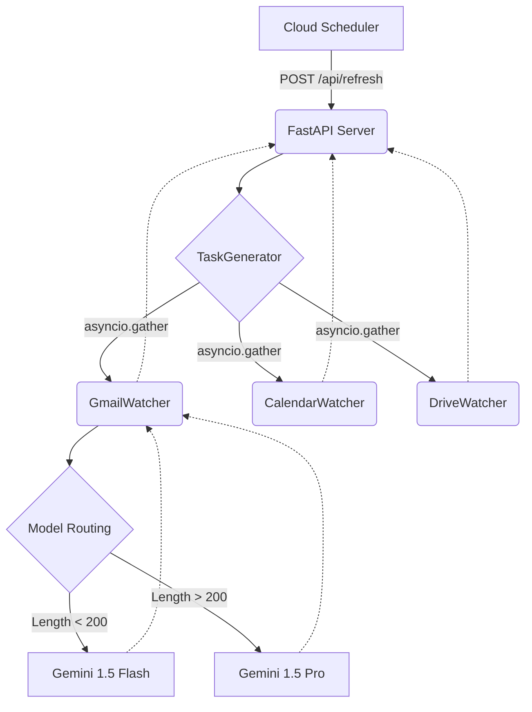

# AutoTracker: Advanced AI Pipeline

AutoTracker is a production-grade backend agent managing zero-touch To-Do processing across Google Workspaces. It intelligently scans your environment asynchronously and outputs priority bounds dynamically!

## Architecture Diagram

## System Instructions
Running natively inside Google Cloud Run. We map strict telemetry to Cloud Logging automatically via HTTP middlewares capturing `X-Cloud-Trace-Context`, mapping latency profiles back dynamically. The application relies on `tenacity` bounds mapping exponential backoffs natively avoiding rate limit crashes!

## Prompt Engineering Strategy
We strictly deploy **Pydantic mapping**. The Gemini AI outputs strictly parsed representations natively, catching missing tokens, establishing `effort_score` values, and isolating contexts without hallucinative JSON failures. Prompt requests natively execute token optimization by measuring lengths explicitly preventing bottlenecks during execution scaling!
